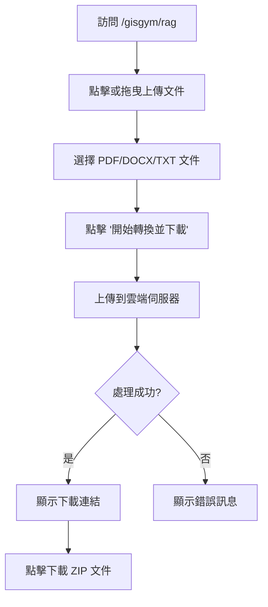

# RAG 頁面使用說明

## 📄 功能概述

RAG (Retrieval-Augmented Generation) 頁面允許用戶上傳 PDF/DOCX 文件，透過雲端伺服器進行 Embedding 運算，並下載打包好的 FAISS 向量索引。

## 🔗 訪問路徑

- **開發環境**: `http://localhost:8080/gisgym/rag`
- **生產環境**: `https://yourdomain.com/gisgym/rag`

## 🎯 主要功能

### 1. 文件上傳
- 支援的文件格式：`.pdf`, `.docx`, `.txt`
- 兩種上傳方式：
  - 點擊上傳區域選擇文件
  - 拖曳文件到上傳區域

### 2. 雲端處理
- API 端點：`https://kevin7261-gisgym.hf.space/process`
- 處理流程：
  1. 文件上傳到雲端伺服器
  2. 伺服器進行 Embedding 運算
  3. 生成 FAISS 向量索引
  4. 打包成 ZIP 文件

### 3. 下載結果
- 成功處理後，頁面會顯示下載連結
- 下載的文件名格式：`{原文件名}_faiss.zip`

## 💻 技術實現

### 組件位置
- **Vue 組件**: `src/views/RagView.vue`
- **路由配置**: `src/router/index.js`

### 主要特性
1. **響應式設計**：支援桌面和移動設備
2. **拖曳上傳**：支援拖放文件上傳
3. **狀態管理**：實時顯示處理狀態
4. **錯誤處理**：完善的錯誤提示機制
5. **載入動畫**：處理過程中顯示載入指示器

### 組件結構

```vue
<template>
  <!-- 上傳區域 -->
  <div class="upload-area" @click="觸發文件選擇" @drop="拖放處理">
    <input type="file" accept=".pdf,.docx,.txt" />
  </div>

  <!-- 處理按鈕 -->
  <button @click="processFile" :disabled="未選擇文件 || 處理中">
    <span v-if="isProcessing" class="loader"></span>
    <span>{{ buttonText }}</span>
  </button>

  <!-- 狀態訊息 -->
  <div v-if="statusMessage" :class="statusClass">
    {{ statusMessage }}
  </div>

  <!-- 下載連結 -->
  <div v-if="downloadUrl">
    <a :href="downloadUrl" :download="downloadFileName">
      🔗 點擊下載 {{ downloadFileName }}
    </a>
  </div>
</template>
```

## 🎨 樣式設計

### 顏色主題
```css
--primary-color: #4f46e5;  /* 主要顏色（靛藍色）*/
--primary-hover: #4338ca;  /* 懸停顏色 */
--bg-color: #f3f4f6;       /* 背景顏色 */
--card-bg: #ffffff;        /* 卡片背景 */
--text-color: #1f2937;     /* 文字顏色 */
```

### 響應式斷點
- **手機版** (`max-width: 640px`)：縮小間距和字體
- **平板版** (`641px - 1024px`)：標準佈局
- **桌面版** (`1025px+`)：完整佈局

## 🔄 使用流程



## ⚠️ 注意事項

1. **冷啟動延遲**：若雲端主機處於休眠狀態，首次執行可能需要等待 1-2 分鐘
2. **文件大小限制**：取決於雲端伺服器的設定
3. **網路連線**：需要穩定的網路連線進行文件上傳和下載
4. **瀏覽器支援**：建議使用現代瀏覽器（Chrome、Firefox、Safari、Edge）

## 🐛 常見問題

### Q1: 上傳後沒有反應？
**A**: 檢查以下項目：
- 雲端伺服器是否正常運行
- 網路連線是否穩定
- 瀏覽器控制台是否有錯誤訊息

### Q2: 下載的文件打不開？
**A**: 確認：
- 下載是否完整（檢查文件大小）
- ZIP 文件是否損壞
- 使用正確的解壓縮工具

### Q3: 處理時間過長？
**A**: 可能原因：
- 伺服器冷啟動（首次執行需等待 1-2 分鐘）
- 文件過大
- 伺服器負載過高

## 🚀 部署說明

### 本地開發
```bash
# 啟動開發伺服器
npm run serve

# 訪問頁面
# 打開瀏覽器訪問: http://localhost:8080/gisgym/rag
```

### 生產部署
```bash
# 構建生產版本
npm run build

# 部署到伺服器
npm run deploy
```

## 📊 API 規格

### 端點：POST /process

**請求**：
- Content-Type: `multipart/form-data`
- Body: `file` (文件)

**回應**：
- Content-Type: `application/zip`
- Content-Disposition: `attachment; filename="xxx_faiss.zip"`
- Body: ZIP 文件（二進制）

**錯誤回應**：
- Status: 4xx 或 5xx
- Body: 錯誤訊息（文字）

## 🔧 自訂配置

### 修改 API 端點
在 `RagView.vue` 中修改：

```javascript
const API_URL = 'https://your-api-endpoint.com/process';
```

### 修改接受的文件類型
在模板中修改：

```html
<input type="file" accept=".pdf,.docx,.txt,.md" />
```

## 📝 版本歷史

### v1.0.0 (2026-01-20)
- ✨ 初始版本發布
- 🎨 響應式 UI 設計
- 📤 支援拖曳上傳
- 🔄 整合雲端 API
- 📦 自動下載處理結果

## 👨‍💻 開發者

- **作者**: Kevin Cheng
- **專案**: GISGym
- **日期**: 2026-01-20

## 📧 聯絡資訊

如有問題或建議，請聯繫：
- Email: [your-email@example.com]
- GitHub: [your-github-profile]

---

**注意**：此文件會隨著功能更新而持續更新。最後更新日期：2026-01-20
