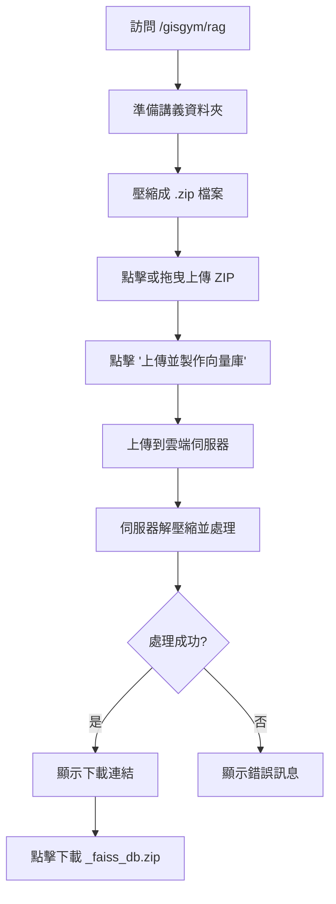

# RAG 頁面使用說明

## 📄 功能概述

RAG (Retrieval-Augmented Generation) 頁面允許用戶上傳包含多個文件的 ZIP 壓縮檔，透過雲端伺服器進行 Embedding 運算，並下載打包好的 FAISS 向量索引。

**重要特性**：
- 支援巢狀資料夾結構 (Nested Folders)
- 自動保留檔案路徑資訊，方便 RAG 溯源
- 可包含多種文件類型（PDF, DOCX, TXT, Code 等）

## 🔗 訪問路徑

- **開發環境**: `http://localhost:8080/gisgym/rag`
- **生產環境**: `https://yourdomain.com/gisgym/rag`

## 🎯 主要功能

### 1. ZIP 檔上傳
- 支援的文件格式：`.zip` 壓縮檔
- ZIP 檔內可包含：`.pdf`, `.docx`, `.txt`, 程式碼檔案等
- 支援巢狀資料夾結構
- 兩種上傳方式：
  - 點擊上傳區域選擇文件
  - 拖曳文件到上傳區域

### 2. 雲端處理
- API 端點：`https://kevin7261-gisgym.hf.space/process_zip`
- 處理流程：
  1. ZIP 檔上傳到雲端伺服器
  2. 伺服器自動解壓縮並提取所有文件
  3. 對所有文件進行 Embedding 運算
  4. 生成 FAISS 向量索引（保留檔案路徑資訊）
  5. 打包成 ZIP 文件

### 3. 下載結果
- 成功處理後，頁面會顯示下載連結
- 下載的文件名格式：`{原文件名}_faiss_db.zip`

## 💻 技術實現

### 組件位置
- **Vue 組件**: `src/views/RagView.vue`
- **路由配置**: `src/router/index.js`

### 主要特性
1. **響應式設計**：支援桌面和移動設備
2. **拖曳上傳**：支援拖放文件上傳
3. **狀態管理**：實時顯示處理狀態
4. **錯誤處理**：完善的錯誤提示機制
5. **載入動畫**：處理過程中顯示載入指示器

### 組件結構

```vue
<template>
  <!-- 提示框 -->
  <div class="tip">
    💡 <strong>提示：</strong> 支援巢狀資料夾結構 (Nested Folders)。
    系統會自動保留檔案路徑資訊，方便 RAG 溯源。
  </div>

  <!-- 上傳區域 -->
  <div class="upload-area" @click="觸發文件選擇" @drop="拖放處理">
    <input type="file" accept=".zip" />
  </div>

  <!-- 處理按鈕 -->
  <button @click="processFile" :disabled="未選擇文件 || 處理中">
    <span v-if="isProcessing" class="loader"></span>
    <span>{{ buttonText }}</span>
  </button>

  <!-- 狀態訊息 -->
  <div v-if="statusMessage" :class="statusClass">
    {{ statusMessage }}
  </div>

  <!-- 下載連結 -->
  <div v-if="downloadUrl">
    <a :href="downloadUrl" :download="downloadFileName">
      🔗 點擊下載 {{ downloadFileName }}
    </a>
  </div>
</template>
```

## 🎨 樣式設計

### 顏色主題
```css
--primary-color: #4f46e5;  /* 主要顏色（靛藍色）*/
--primary-hover: #4338ca;  /* 懸停顏色 */
--bg-color: #f3f4f6;       /* 背景顏色 */
--card-bg: #ffffff;        /* 卡片背景 */
--text-color: #1f2937;     /* 文字顏色 */
```

### 特殊樣式類別

**提示框 (.tip)**：
- 背景色：淺綠色 (#d1fae5)
- 文字色：深綠色 (#047857)
- 用途：顯示重要提示和功能說明

**狀態訊息 (.status-success/.status-error/.status-info)**：
- success：綠色主題，表示成功
- error：紅色主題，表示錯誤
- info：藍色主題，表示處理中

**注意事項 (.note)**：
- 背景色：淺紅色 (#fef2f2)
- 文字色：紅色 (#dc2626)
- 用途：顯示重要注意事項

### 響應式斷點
- **手機版** (`max-width: 640px`)：縮小間距和字體
- **平板版** (`641px - 1024px`)：標準佈局
- **桌面版** (`1025px+`)：完整佈局

## 🔄 使用流程



## 📁 準備 ZIP 檔案

### 建議結構
```
講義資料夾/
├── 第一章/
│   ├── lecture1.pdf
│   ├── notes.docx
│   └── code_examples.py
├── 第二章/
│   ├── lecture2.pdf
│   └── homework.txt
└── README.md
```

### 壓縮步驟
1. 將所有講義整理到一個資料夾中
2. 可以包含多層巢狀子資料夾
3. 右鍵點擊資料夾 → 壓縮
4. 確認副檔名為 `.zip`

## ⚠️ 注意事項

1. **文件格式限制**：僅接受 `.zip` 格式的壓縮檔
2. **文件大小**：檔案大小請勿過大，以免連線逾時
3. **冷啟動延遲**：若 Hugging Face 主機休眠中，首次執行可能需等待 1-3 分鐘喚醒
4. **網路連線**：需要穩定的網路連線進行文件上傳和下載
5. **瀏覽器支援**：建議使用現代瀏覽器（Chrome、Firefox、Safari、Edge）
6. **檔案路徑**：系統會自動保留 ZIP 內的資料夾結構，方便後續溯源

## 🐛 常見問題

### Q1: 為什麼只能上傳 ZIP 檔？
**A**: 為了支援批次處理多個文件，並保留資料夾結構以便後續溯源。您可以將所有講義整理到一個資料夾中，然後壓縮成 ZIP 上傳。

### Q2: 上傳時顯示「僅支援 .zip 格式」？
**A**: 請確認：
- 文件副檔名是 `.zip`（不是 `.rar`, `.7z` 等其他格式）
- 使用正確的壓縮工具（Windows 內建壓縮、macOS 內建壓縮、7-Zip 等）
- 沒有選錯檔案類型

### Q3: 上傳後沒有反應？
**A**: 檢查以下項目：
- 雲端伺服器是否正常運行
- 網路連線是否穩定
- 瀏覽器控制台是否有錯誤訊息
- ZIP 檔案大小是否過大

### Q4: 下載的文件打不開？
**A**: 確認：
- 下載是否完整（檢查文件大小）
- ZIP 文件是否損壞
- 使用正確的解壓縮工具

### Q5: 處理時間過長？
**A**: 可能原因：
- 伺服器冷啟動（首次執行需等待 1-3 分鐘）
- ZIP 檔案過大或包含大量文件
- 伺服器負載過高
- 網路連線不穩定

### Q6: ZIP 內可以包含哪些文件類型？
**A**: 支援多種文件類型，包括但不限於：
- 文件：PDF, DOCX, TXT, MD
- 程式碼：PY, JS, JAVA, CPP, etc.
- 其他：CSV, JSON, XML, etc.
（具體支援取決於後端伺服器的設定）

## 🚀 部署說明

### 本地開發
```bash
# 啟動開發伺服器
npm run serve

# 訪問頁面
# 打開瀏覽器訪問: http://localhost:8080/gisgym/rag
```

### 生產部署
```bash
# 構建生產版本
npm run build

# 部署到伺服器
npm run deploy
```

## 📊 API 規格

### 端點：POST /process_zip

**請求**：
- Content-Type: `multipart/form-data`
- Body: `file` (ZIP 壓縮檔)

**回應**：
- Content-Type: `application/zip`
- Content-Disposition: `attachment; filename="xxx_faiss_db.zip"`
- Body: ZIP 文件（二進制，包含 FAISS 向量索引）

**錯誤回應**：
- Status: 4xx 或 5xx
- Body: 錯誤訊息（文字）

**處理流程**：
1. 接收 ZIP 檔案
2. 解壓縮並遍歷所有文件
3. 提取文本並進行 Embedding
4. 保留檔案路徑資訊
5. 生成 FAISS 索引
6. 打包並返回

## 🔧 自訂配置

### 修改 API 端點
在 `RagView.vue` 中修改：

```javascript
const API_URL = 'https://your-api-endpoint.com/process_zip';
```

### 修改接受的文件類型
在模板中修改（目前僅支援 ZIP）：

```html
<input type="file" accept=".zip" />
```

**注意**：如果要支援其他壓縮格式（如 .rar, .7z），需要同時修改：
1. 前端 `accept` 屬性
2. 前端格式檢查邏輯
3. 後端解壓縮邏輯

## 📱 如何使用

### 完整步驟

#### 1. 準備資料
- 將所有講義文件整理到一個資料夾中
- 可以包含多層巢狀資料夾
- 支援多種文件格式（PDF, DOCX, TXT, 程式碼等）

#### 2. 壓縮成 ZIP
- Windows：右鍵 → 傳送到 → 壓縮的 (zipped) 資料夾
- macOS：右鍵 → 壓縮
- Linux：`zip -r archive.zip folder/`

#### 3. 上傳處理
1. 訪問 `http://localhost:8080/gisgym/rag`
2. 點擊上傳區域或拖曳 ZIP 文件
3. 確認已選擇正確的 ZIP 檔案
4. 點擊「上傳並製作向量庫」按鈕
5. 等待處理完成（首次可能需要 1-3 分鐘冷啟動）

#### 4. 下載結果
1. 處理完成後會顯示綠色成功訊息
2. 點擊下方的下載連結
3. 獲取 `{原檔名}_faiss_db.zip` 文件

#### 5. 使用向量庫
- 解壓縮下載的 ZIP 檔案
- 使用 FAISS 讀取向量索引
- 進行相似度搜索或 RAG 應用

## 📝 版本歷史

### v2.0.0 (2026-01-20)
- ✨ **重大更新**：改為支援 ZIP 檔案上傳
- 📦 支援巢狀資料夾結構
- 🔍 自動保留檔案路徑資訊以便溯源
- 📄 支援批次處理多種文件類型
- 🎨 更新 UI 和提示訊息
- 🔄 API 端點更新為 `/process_zip`

### v1.0.0 (2026-01-20)
- ✨ 初始版本發布
- 🎨 響應式 UI 設計
- 📤 支援拖曳上傳
- 🔄 整合雲端 API
- 📦 自動下載處理結果

## 👨‍💻 開發者

- **作者**: Kevin Cheng
- **專案**: GISGym
- **日期**: 2026-01-20

## 📧 聯絡資訊

如有問題或建議，請聯繫：
- Email: [your-email@example.com]
- GitHub: [your-github-profile]

---

## 🎯 使用範例

### 範例 1：課程講義整理
```
課程資料夾/
├── Week1/
│   ├── lecture1.pdf
│   └── homework1.docx
├── Week2/
│   ├── lecture2.pdf
│   └── homework2.docx
└── 參考資料/
    ├── textbook.pdf
    └── slides.pptx
```
壓縮成 `course_materials.zip` 上傳，下載得到 `course_materials_faiss_db.zip`

### 範例 2：程式碼文檔
```
project_docs/
├── api/
│   ├── auth.md
│   └── endpoints.md
├── examples/
│   ├── example1.py
│   └── example2.py
└── README.md
```
壓縮成 `project_docs.zip` 上傳，下載得到 `project_docs_faiss_db.zip`

---

**注意**：此文件會隨著功能更新而持續更新。

- **版本**：v2.0.0
- **最後更新日期**：2026-01-20
- **更新內容**：改為支援 ZIP 檔案上傳，支援巢狀資料夾結構
